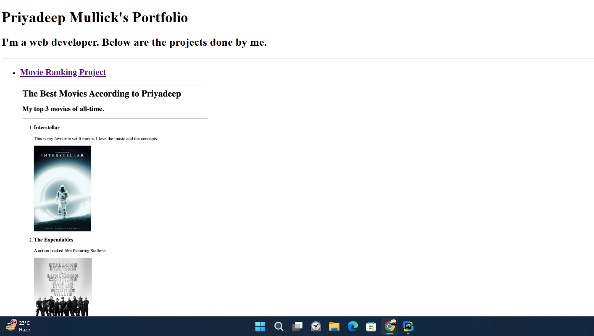
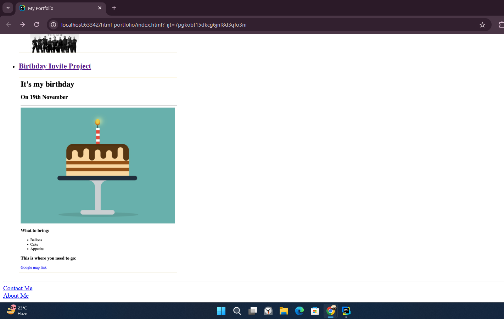

# DevEvolution-2023to2025 🚀

This repository is a **time capsule** of my earliest web development projects from **June 2023**—a reminder of where I started and how far I've come.

## 📖 The Backstory
In **June 2023**, I built this simple portfolio using **HTML & CSS** to showcase two beginner projects:
- **Movie Ranking Project** 🎬 - A static webpage listing my favorite movies.
- **Birthday Invite Project** 🎉 - A basic invitation page.

Back then, I was just getting started with **HTML, structuring pages, and linking files**. Fast forward to **2025**, and now I work with:  
✅ **React** (Dynamic frontends)  
✅ **Flask** (Backend development)  
✅ **Tailwind CSS** (Modern styling)  
✅ **JavaScript & SQL** (Full-stack capabilities)  
✅ **3D Animations** (Advanced UI/UX)

This project is a **testament to my evolution**, from basic static pages to building complex full-stack applications.

## 📂 Folder Structure  

## 🌟 Preview
| Project | Preview                                                           |
|---------|-------------------------------------------------------------------|
| **Movie Ranking Project** |    |
| **Birthday Invite Project** |  |

## 🔗 Live Demo
You can visit the site at GitHub pages: **[Click Here](https://deep-priyo.github.io/DevEvolution-2023to2025/)**

---  

**This project represents my starting point in web development—just simple HTML pages back then. From here, I moved on to CSS, JavaScript, Flask, full-stack applications, and beyond. Looking back at this reminds me of how far I've come and how much more there is to learn.** 🚀  
